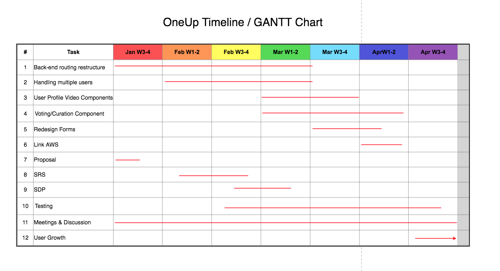

## 4.0 Software Development Plan

### 4.1 Plan Introduction

This Software Development Plan documents the planned development for the second half of the OneUp web application, a site aimed at exposing young skateboard talent through the use of crowdsourced curation. To recap, the app will essentially be a video database of user uploaded skate clips that are curated by upvotes and downvotes from other users. Skaters are constantly aiming to get sponsored while building their personal brand, and Oneup is a space where they can surface up democratically.

Part 1 involved building the main framework and design for OneUp, which included building the main front end components, database, and server. However, due to time constraints we left out some key features essential for the completion of this project. This document will explain how we plan on tackling these remaining issues including the restructuring of routing, redesign of key components, and much more.  

Part 1 SDP for this webapp can be found here: https://github.com/khiemlu96/OneUp/blob/master/documents/Software_Dev_Plan.md 

Milestones

- Week 02: Project Proposal
- Week 05: Software Requirements Specification Document
- Week 07: Restructure backend routing
- Week 09: Software Development Plan
- Week 10: Handle multiple users case
- Week 11: 
  - Updated Sofware Plan
  - Upvote/Curation component completed
- Week 12: User page video component
- Week 13: Re-submit Requirements Specification Document
- Week 14: 
  - Redesign submission forms
  - Preliminary Demonstration Presentations
- Week 16: Link with AWS 
- Week 17:
	- Final Product Delivery
	- Final Project Presentation

	
#### 4.1.1 Project Deliverables

- Week 02: Project Proposal
  - Proposal document of what we have learned from our initial experience with OneUp and why we decided to continue it.
  - Presentation of these ideas.
  - Organization of our approach to finishing OneUp
- Week 05: Software Requirements Specification Document
  - Software Requirements Specification (SRS) document which includes the low-level details and requirements of our system. This includes CSCIs, CSCs, and CSUs that reflect the functionality of each layer within the 3 tier architecture.
  - Tasks split up between team.
- Week 07: Restructure backend routing
  - Reformat to react routing in situations that don't require server side routing
  - Restructure user login for secure authentication
- Week 09: Software Development Plan
  - Software Development Plan (SDP) which describes the process to building the application including scheduling and software/hardware resources.
  - Organize meetings, communication lines, and assign official titles to each team member
- Week 10: Handle multiple users case
  - Handle multiple user logins with correct routing using token authentication
  - Voting components handle multiple votes (limit 1 vote per user on a specific video)
- Week 11: Updated Sofware Plan & Upvote/Curation component completed
  - Edited and updated software plan keeping track of tasks completed
  - Redesigned upvoting and downvoting function that links to backend 
  - Components curated are categorized by week
- Week 12: User page video component
  - Video component for user uploaded videos and upvoted videos completed
- Week 13: Re-submit Requirements Specification Document
  - Edited and updated Requirements Specification Document with missing features overlooked previously
- Week 14: Redesign submission forms & Preliminary Demos
  - Front-end redesign on forms for efficiency and beautiful UI
  - Demonstrate OneUp near completion
- Week 16: Link with AWS 
  - Completed connection to database with AWS
- Week 17: Final Product Delivery & Final Project Presentation
  - Completed Product Delivery with all documents on GitHub
  - OneUp launched on a public domain.
	

### 4.2 Project Resources

#### 4.2.1 Hardware Resources

Development and demonstration for the project require the same hardware:
- MacBook Pro
	- Processor: 2.5 GHz Intel Core i7
	- Memory: 16 GB 1600 MHz DDR3
	- Graphics: Intel Iris Pro 1536 MB
- WiFi with possible but improbable latency issues
- AWS Servers
	
#### 4.2.2 Software Resources

- Sublime Text Editor
- Atom Text Editor
- macOS
- Node.js v8.6.0
- React.js v16.0.0
- Express v4.16.2
- EJS v2.5.7
- Webpack v3.6.0
- Babel v6.26.0
- Nodemon v1.12.1
- Bootstrap
- GitHub
- GridFS

### 4.3 Project Organization

The remaining of the project involves mainly a complete restructure of the back-end and redesign of the front-end components for efficiency and beauty. Each team member will have a lead role for each part of this particular architecture (Khiem being the front-end lead and Justin being the back-end lead). However, since our team consists of only 2 people, we will primarily have shared roles across all layers of the architecture.

The team meets every Sunday at 12pm to discuss the current state of the project and goals that have yet to be accomplished. Aside from the weekly team meetings, we communicate through an app called “Slack” to discuss implementation strategies or any concerns.

Name            | Role
----------------|----------------------
Khiem Lu	| Product/Project Manager, Front-End Design, Database Developer, Back-End Developer
Justin Lee 	| Back-End Lead,  Front-End Developer, Database Design

### 4.4 Project Schedule

#### 4.4.1 GANTT Chart

	
	

Note: We will be meeting and discussing almost every other day.

#### 4.4.2 Task/Resource Table

We plan on doing everything together without splitting up the workload too much.

Task     					     | Hardware              | Software                          | Person     
---------------------------------------------------- | --------------------- | --------------------------------- |------------
Handling multiple users		     | Macbook Pro           | Node.js, React, MongoDB, macOS    | Khiem, Justin
Front-end redesign, video modals, AWS          | Macbook Pro           | Node.js, React, MongoDB, macOS    | Khiem
Back-end restructure, curation structure             | Macbook Pro           | Node.js, React, MongoDB, macOS    | Justin

